<div align="center">
    <h1><B>Card King</B></h1>
  
</div>

## Our Goal
Are you interested in the world of sports and Pokemon cards. If so this is the app for you, 
using Card King you are able to scan and value your cards to determine how much they are worth. 
Are you interested in sending a card off to grading, if so grade your card with Card King's AI grading
to give you an idea of what grade your card will receive. Are you an avid collector, if so, you can add your cards to your collection
and see how many cards you have and how much they are worth.

## App Core functionality

### Signup
This allows users to create an account using an email and a password that is at least 6 characters. 

 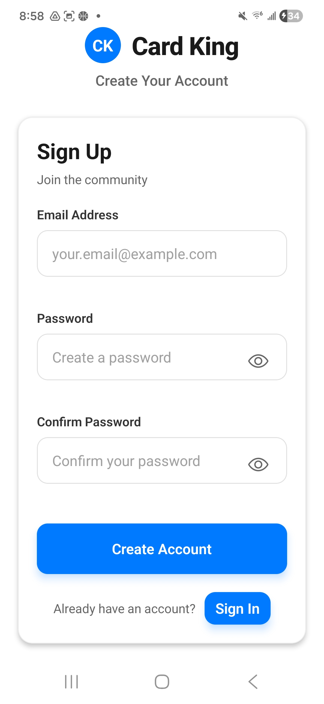

### Login
This allows users to login into the app using firebase with the account they created, using email and password.

 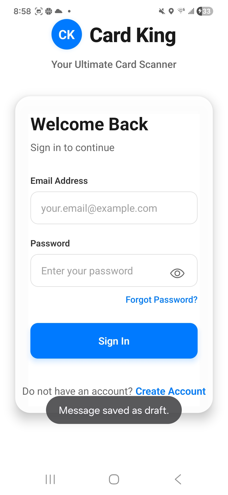

 ### Reset Password
 If a user does not know their password they can reset their password, which sends a password reset link to their email.

 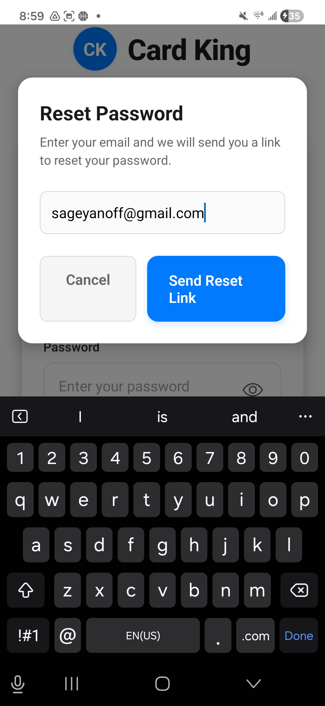

 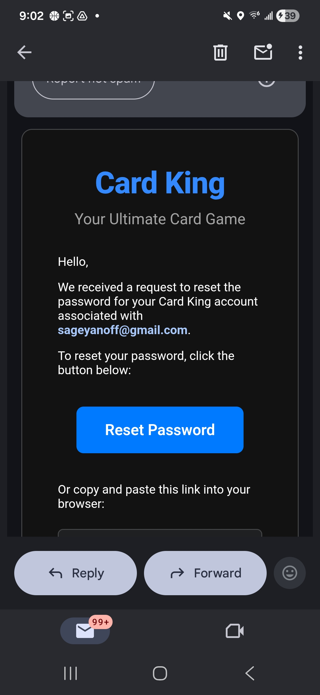

 ### Home Page
 This provides the user with a dynamic UI with access to all the apps essential features including: valuing cards, grading cards, collection view, and changing your profile picture.

 This page also shows a live view of how many cards are in your collection, how many of those cards are virtually graded and the value of your collection excluding your graded cards, because they are not offically graded. 

 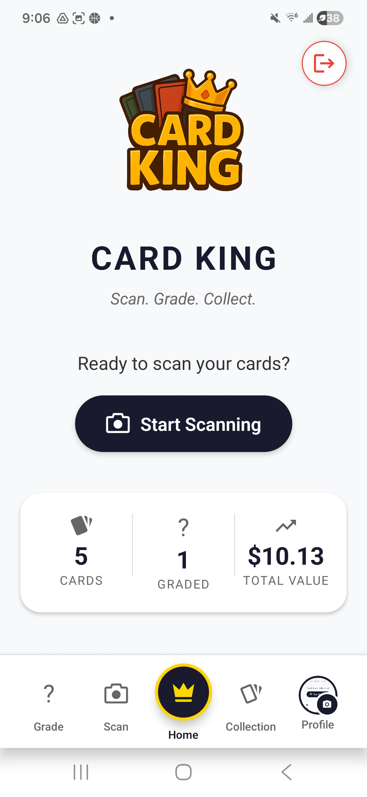

### Grade card
This allows users to scan the front and back of their cards and receive a virtual grade of the card.

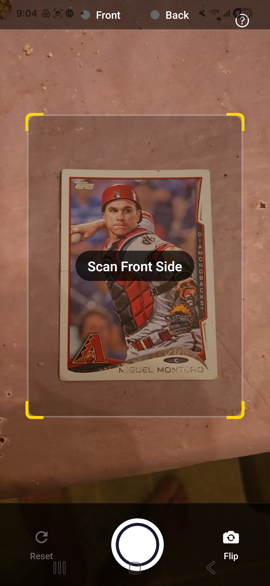

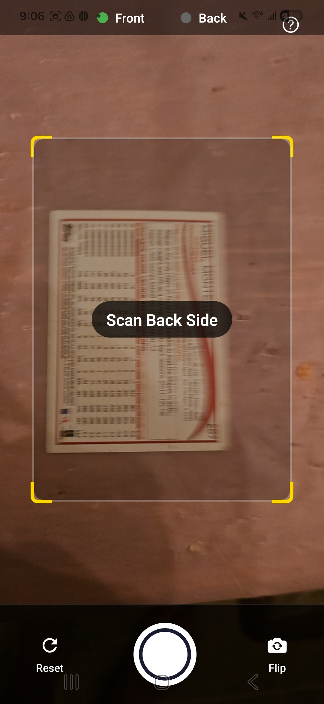

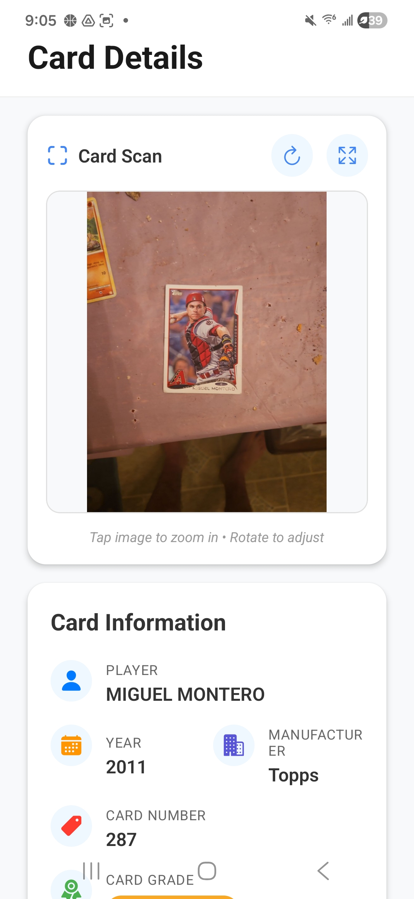

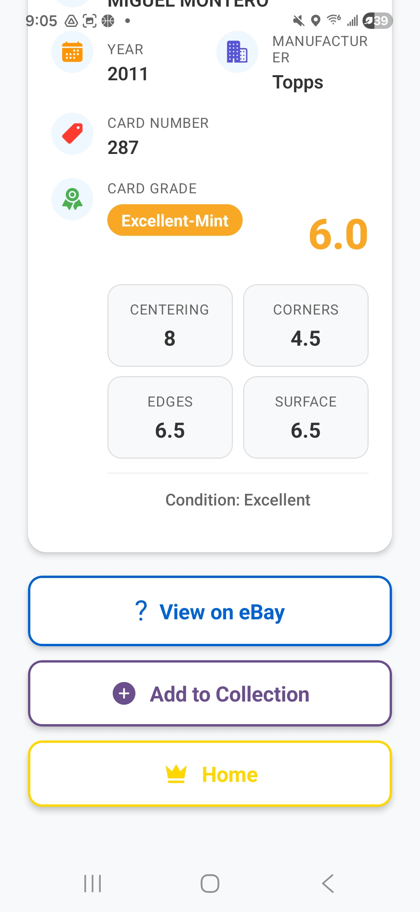

### Scan card
This allows users to scan the front and back of cards and receive the average market value of their cards.

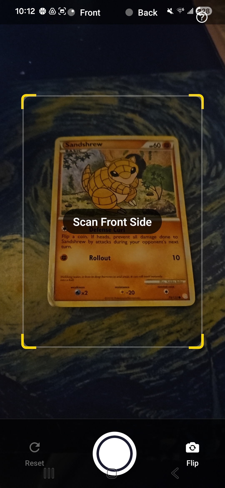

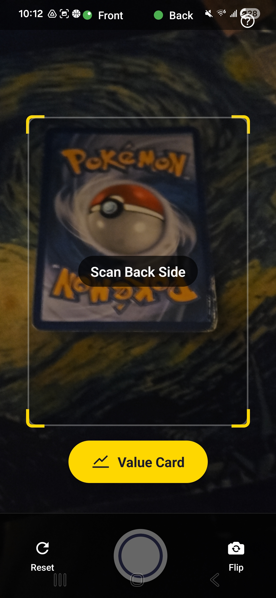

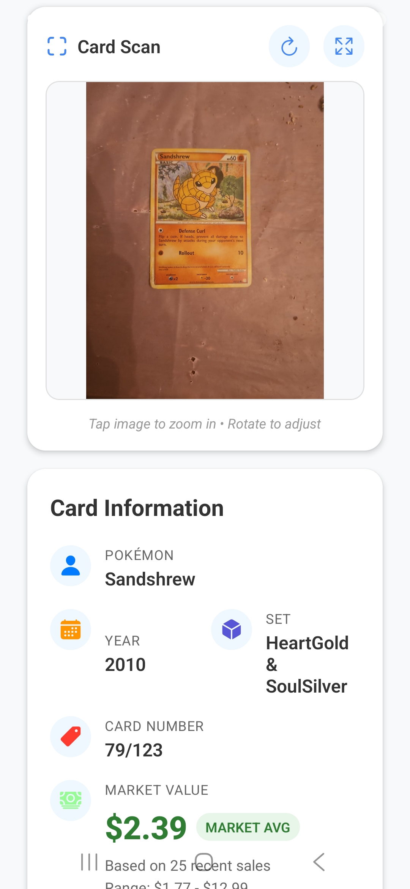

### Collection View
This allows the users to view their cards in their collection and see the grade or price of their cards

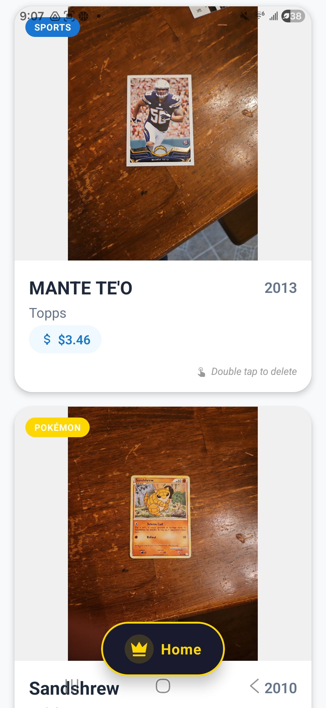

### Profile Picture
This allows users to be able to upload and change their profile picture from their gallery photos
<div align="left">
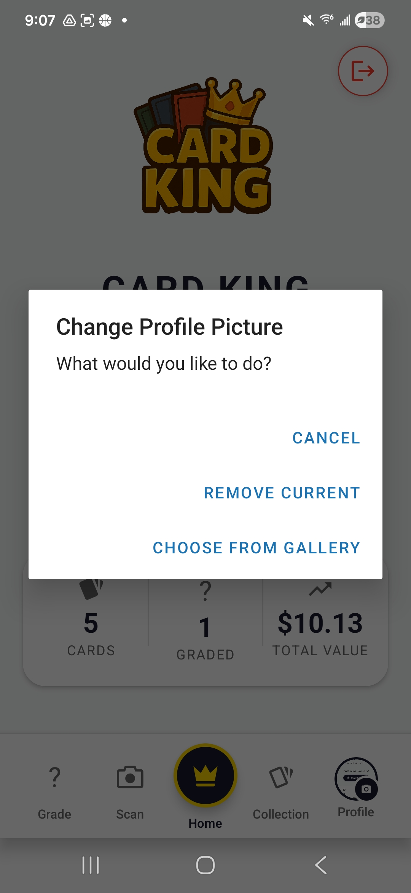
</div>

## Running the App
This app has a downloadable APK for Android and for Apple you can run the app using expo go and by clonig the source code locally.

### Android APK
## 📱 Download

**[Click here to download the APK on your Android device](https://expo.dev/accounts/sageman/projects/cardking/builds/b8ad867a-9a0c-49ac-8d23-3cb035ab1f82)**

## Running it on Apple

### Prerequisites
- Node.js installed on your machine
- Expo Go app installed on your iphone
- Same WiFi network for phone and laptop

### Installation

1. **Clone the repository**
```bash
git clone https://github.com/yourusername/Card-King.git
cd CardKing

```

2. **Create a `.env` file** in the root directory
```bash
touch .env
```

3. **Add the following environment variables** to your `.env` file
```env
GOOGLE_VISION_API_KEY=
EXPO_PUBLIC_FIREBASE_API_KEY=
EXPO_PUBLIC_FIREBASE_AUTH_DOMAIN=
EXPO_PUBLIC_FIREBASE_PROJECT_ID=
EXPO_PUBLIC_FIREBASE_STORAGE_BUCKET=
EXPO_PUBLIC_FIREBASE_MESSAGING_SENDER_ID=
EXPO_PUBLIC_FIREBASE_APP_ID=
EXPO_NO_ERROR_OVERLAY=
EXPO_XIMILAR_API_KEY=
```

4. **Install dependencies**
```bash
npm install
```

5. **Start the development server**
```bash
npx expo start
```

> **Note:** Ensure your phone and laptop are connected to the same WiFi network before running `npx expo start`. Scan the QR code with Expo Go to run the app on your device.

## Running the Test Files

### Prerequisites
- Jest is installed
- React Native Testing Library is installed

### Installation

1. **Install dependencies**
```bash
cd CardKing
npm install
```
2. **Run Test Suites**
```
npm test
```
> **Note:** 'npm test' will run all available test suites found in the __tests__ folder. To compile and run a specific suite, use the command 'npm test __tests__/{REPLACE WITH TEST FILE NAME}'.
